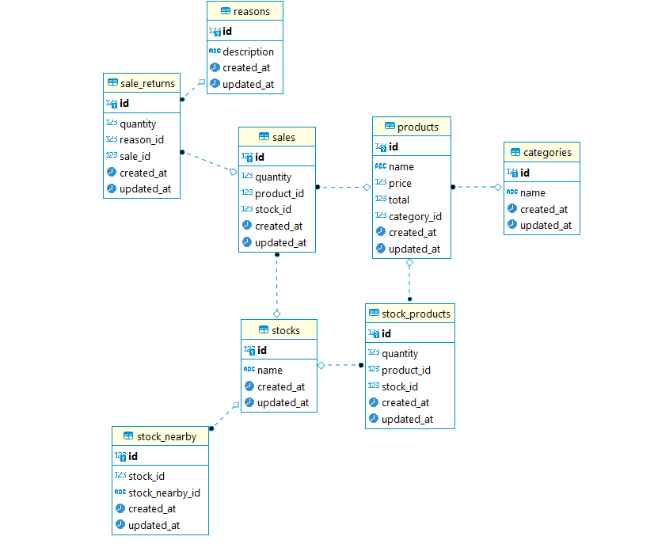

# Final-challenge-backend


This is the final back-end challenge delivered to Growdev, using all the technologies learned during classes.

## 💡 Undestanding the problem

The customer needs to **control their stocks, sales, and sales return**. Today he doesn't know **which category or which product has a higher return**. Often, when starting a sale, he doesn't known whether the product is in stock. Therefore, the customer set up 3 stocks in different places and if one stock doesn't have the product to sell, **he can pick up the nearest one**, if have this permission.

## 💻 The project

**We developed an API in order to propose a solution that meets the needs of the client**. In it, the customer is able to control his stock of products, his sales and sales return, respecting his business rules.
The API documentation is available on Swagger.

### 🔍 Database model

<div align="center">
  
</div>

## ⚙ Technologies and tools used

- Javascript
- Nodejs
- Axios / Express
- Nodemon / Sucrase
- PostgreSQL (database)
- Sequelize (data manipulation)
- Jest (TDD)
- Swagger (Documentation)

## 🚀 How to run the project?

Before start, install [Git](https://git-scm.com), [Node.js](https://nodejs.org/en/) and [Yarn](https://classic.yarnpkg.com/en/docs/install/#windows-stable) on your machine. Moreover, recommend use the [VSCode](https://code.visualstudio.com/) terminal.

```bash
# Clone this repository
$ git clone https://github.com/cunhasbia/final-challenge-backend.git

# Access the repository on your terminal
$ cd final-challenge-backend

# Install dependencies
$ yarn

# Run migrations to database
$ yarn sequelize db:migrate

# Run seeds, to insert information into the database
$ yarn sequelize db:seed:all

# Run
$ yarn dev

# The API will be running on port 3333
```

<p align="center">
  <a href="https://github.com/cunhasbia/final-challenge-backend/blob/main/Workspace_Insomnia" target="_blank">
    Click here to use the Insomnia workspace and access the routes.
  </a>
</p>

## 👩‍💻 Authors/Team  
<table>
  <tr>
    <td align="center">
      <a href="https://github.com/cunhasbia">
        <br>
        <sub><b>Bianca Cunha</b></sub>
      </a><br>
    </td>
    <td align="center">
      <a href="https://github.com/Ferreira94">
        <br>
        <sub><b>Luciano Ferreira</b></sub>
      </a><br>
    </td>
    <td align="center">
      <a href="https://github.com/lurnakata">
        <br>
        <sub><b>Lucimara Nakata</b></sub>
      </a><br>
    </td>
    <td align="center">
      <a href="https://github.com/ThiellyLanger">
        <br>
        <sub><b>Thielly Langer</b></sub>
      </a><br>
    </td>
    <td align="center">
      <a href="https://github.com/vivianebresolin">
        <br>
        <sub><b>Viviane Bresolin</b></sub>
      </a><br>
    </td>
    <td align="center">
      <a href="https://github.com/stilljag">
        <br>
        <sub><b>William Ribeiro</b></sub>
      </a><br>
    </td>    
  </tr>
</table>

<hr>

Starter Program - 3rd edition | Growdev
